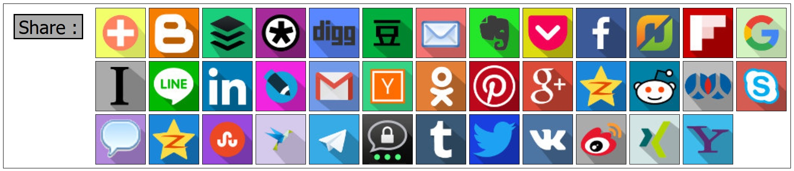
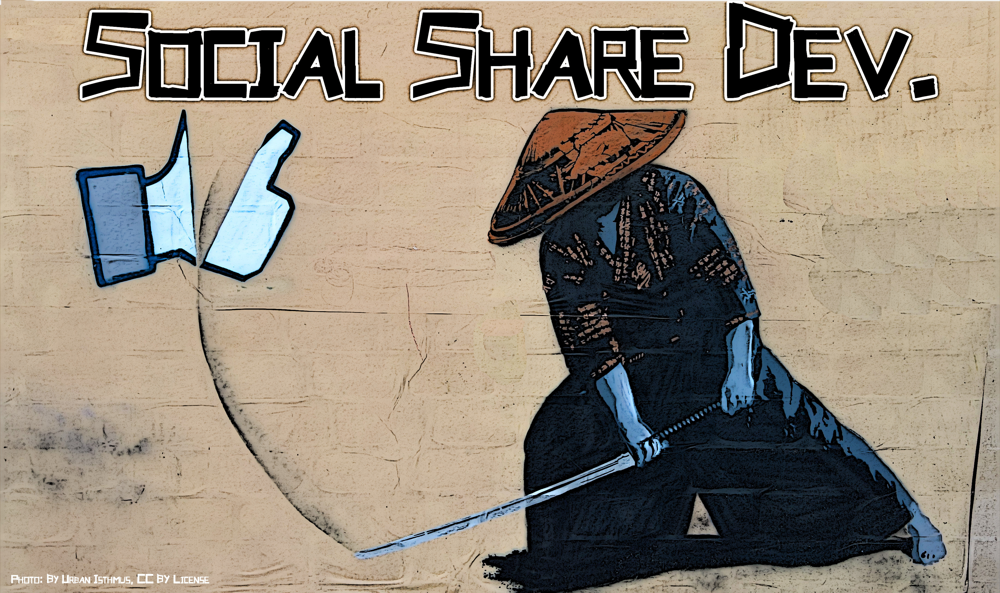

# Social Share URLs

This project is intended to help you integrate sharing on social media within your code.  We have been actively doing this since 2013.



What we try to provide :

* **Source Code Libraries** : To provide basic utilities for generating these social media links in any environment that you need.
    * Currently supporting libraries in : [JavaScript](./code/javascript/), [PHP](./code/php/), [Python](./code/python/), [Java](./code/java/), [Golang](./code/golang/), [ReactJS](./code/reactjs/), [C++](./code/cpp/), [C](./code/c/), [MySQL](./code/mysql/), [C#](./code/csharp/), [Ruby](./code/ruby/), [VB.Net](./code/vb.net/), [Perl](./code/perl/), [Swift](./code/swift/), [Objective-C](./code/swift/).
    * Documentation: Each library has its own demo's, online sandboxes, and sample-use code.
    * Want to know about the code?  Check it out : https://github.com/bradvin/social-share-urls/tree/master/code
* **Icons** : Public domain and permissively-licensed, at an amazing `450x450` resolution.
    * Currently supported themes: `opaque background` (1x set), `white background` (1x set), `background & shadow` (1x set), `colorized background` (10x sets).
    * Want to know about the icons?  Check it out : https://github.com/bradvin/social-share-urls/tree/master/images
* **Regularly-Tested, Basic Share-URL Formats of Popular, Social Media** : Directly linking to share/like pages on that social media with fillable URL, text, and other parameters.
    * For example : `example.com/someSocialMediaSite/share?url=yourWebsiteURL&text=someMessageAboutYourSite`.
    * URL's are organized into category (`multi-language`, `phone-based`, `email-based`, etc.).
    * Each URL category is sorted by `Alexa`-rank.  Know what's important without having to track down the info.
* **Reference Sources** : For each service, URL format, and set of parameters, so that you can feel confident about these links and find out more if you need to do something more interesting.
    * We include primary sources (official documentation or official dev blogs).  We try to provide at least one of these per service.
    * We also include secondary sources (like forum conversations or StackOverflow questions).  We try to provide at least three of these per service.

<p align="center"></p>

## Just Want the Gist?

Want to download just the URL's from this project?  

Then check out our GitHub Gist : https://gist.github.com/HoldOffHunger/1998b92acb80bc83547baeaff68aaaf4

## Demos

Some sites using this project :

* [Mikhail Bakunin : God and the State](http://www.revoltlib.com/anarchism/god-and-the-state/view.php#share)
* [EarthFluent.com : Learn French Online](https://www.earthfluent.com/french/view.php?action=index#share)
* [List Keywords : Finding and Listing Your Keywords For You](http://www.listkeywords.com/)

## Supported Social Networks

### Multi-Language Social Media

*  [GoogleBookmarks](#googlebookmarks)
*  [Facebook](#facebook)
*  [Reddit](#reddit)
*  [Twitter](#twitter)
*  [LinkedIn](#linkedin)
*  [Tumblr](#tumblr)
*  [Pinterest](#pinterest)
*  [Blogger](#blogger)
*  [LiveJournal](#livejournal)
*  [EverNote](#evernote)
*  [AddThis](#addthis)
*  [GetPocket](#getpocket)
*  [HackerNews](#hackernews)
*  [Digg](#digg)
*  [Buffer](#buffer)
*  [FlipBoard](#flipboard)
*  [InstaPaper](#instapaper)
*  [SurfingBird](#surfingbird)
*  [Flattr](#flattr)
*  [Diaspora](#diaspora)

### Non-English Social Media

*  [QZone](#qzone)
*  [VK](#vk)
*  [Weibo](#weibo)
*  [OKru](#okru)
*  [Douban](#douban)
*  [XING](#xing)
*  [RenRen](#renren)
*  [Threema](#threema)

### Phone/Audio-Based Social Media

*  [SMS](#sms)
*  [Line.me](#lineme)
*  [Skype](#skype)
*  [Telegram.me](#telegramme)

### Email-Based Social Media

*  [EMail](#email)
*  [GMail](#gmail)
*  [Yahoo](#yahoo)

### Locally/Personally-Run Social Media

*  [WordPress](#wordpress)

### Deprecated Social Media Share Links

*  [AIM](#aim)
*  [Baidu](#baidu)
*  [Delicious](#delicious)
*  [EchoJS](#echojs)
*  [FBMessenger](#fbmessenger)
*  [FriendFeed](#friendfeed)
*  [Google+](#googleplus)
*  [Mail.Ru](#mailru)
*  [MySpace](#myspace)
*  [NewsVine](#newsvine)
*  [Ping.fm](#pingfm)
*  [ScoopIt](#scoopit)
*  [SinnaWeibo](#sinaweibo)
*  [SlashDot](#slashdot)
*  [StumbleUpon / Mix.com](#stumbleupon)
*  [Viber](#viber)
*  [WhatsApp](#whatsapp)

## URL Arguments

Your URL should be placed in the `url` parameter; if not available, you will need to construct a message about your URL and place that message in the `title` or `text` parameters.

Argument | Description | Used By
--- | --- | ---
{url} | The URL-encoded link you want to share.  Service may reject link if not encoded. | GoogleBookmarks, Facebook, Reddit, Twitter, LinkedIn, Tumblr, Pinterest, Blogger, LiveJournal, EverNote, AddThis, GetPocket, HackerNews, Digg, Buffer, FlipBoard, InstaPaper, SurfingBird, Flattr, Diaspora, Line.me, Skype, Telegram.me, QZone, VK, Weibo, OKru, Douban, XING, RenRen, GMail, Yahoo, WordPress
{title} | The page title of the url you want to share. | GoogleBookmarks, Reddit, LinkedIn, Tumblr, Blogger, LiveJournal, EverNote, HackerNews, FlipBoard, InstaPaper, SurfingBird, Flattr, Diaspora, VK, Weibo, Douban, RenRen, EMail, GMail, Yahoo, WordPress
{text} | A longer description of the content you are sharing. | GoogleBookmarks, Twitter, LinkedIn, Tumblr, Blogger, Buffer, InstaPaper, SurfingBird, Flattr, SMS, Line.me, Skype, Telegram.me, VK, RenRen, Threema, EMail, WordPress
{hash_tags} | Hashtags appended onto the tweet (comma separated. don't include "#"). | GoogleBookmarks, Twitter, Tumblr, Flattr
{user_id} | The username/id of a particular user on a social media service. | Twitter, Flattr, Threema
{email_address} | Where a social share is directed.  You will most likely want to leave this blank, so the user can fill it in. | EMail, GMail, Yahoo
{language_code} | A language code from the ISO 639-1 Code specification. | Flattr
{image} | The url to the image/thumbnail to use when sharing. | SurfingBird, WordPress
{phone_number} | An applicable phone number, if there is one. | SMS, Telegram.me
{app_id} | The App ID. | Facebook
{redirect_url} | The url a sharer will be redirected to after a successful share. | Facebook
{page_type} | Type of page, either "page" or "popup." | Facebook
{category} | A section to submit the share/comment to. | Flattr
{provider} | Service providing the share link. | LinkedIn

## Multi-Language Social Media

### <a name="googlebookmarks" /> GoogleBookmarks

 <code>Global Rank :</code>  `1` (apr. 3, 2018)

<code>Parameters :</code> `bkmk`, `title`, `annotation`, `labels`.

```
https://www.google.com/bookmarks/mark?op=edit&bkmk={url}&title={title}&annotation={text}&labels={hash_tags}
```

<code>Source :</code>
* *Official Source :* Unable to locate.
* *Unofficial Source :*
    * [StackOverflow: Social Share Links with Custom Icons](https://stackoverflow.com/a/49542173/2430549)
    * [StackOverflow: Open source alternative to AddThis AddToAny, ShareThis etcfor Social Bookmarking](https://stackoverflow.com/a/31844778/2430549)
    * [StackOverflow: Wordpress posts show http://google.com/bookmarks/mark?op=edit&title= in front of url](https://stackoverflow.com/q/44287426/2430549)
* *Test Notes :* None.
* *Test Results :* Functionality tested and verified by SocialShare Dev's in `2018`.

### <a name="facebook" /> Facebook

 <code>Global Rank :</code>  `3` (apr. 3, 2018)

#### Facebook (with Sharer)

<code>Parameters :</code> `u`.

```
https://www.facebook.com/sharer.php?u={url}
```

<code>Source :</code>
* *Official Source :* [FaceBook: We have changed the behavior of the sharer plugin...](https://developers.facebook.com/x/bugs/357750474364812/)
* *Unofficial Source :*
    * [StackOverflow: Facebook share link - no javascript](https://stackoverflow.com/q/9120539/2430549)
    * [StackOverflow: Open source alternative to AddThis AddToAny, ShareThis etcfor Social Bookmarking](https://stackoverflow.com/a/31844778/2430549)
    * [StackOverflow: will facebook sharer functionality be supported?](https://stackoverflow.com/q/7907506/2430549)
* *Test Notes :* None.
* *Test Results :* Functionality tested and verified by SocialShare Dev's in `2013`, `2016`, and `2018`.

#### Facebook (with Share Dialog)

<code>Parameters :</code> `app_id`, `page_type`, `href`, `redirect_url`.

```
https://www.facebook.com/dialog/share?app_id={app_id}&display={page_type}&href={url}&redirect_uri={redirect_url}
```

<code>Source :</code>
* *Official Source :* [FaceBook: Share Dialog](https://developers.facebook.com/docs/sharing/reference/share-dialog)
* *Unofficial Source :*
    * [StackOverflow: How create a Facebook share button without SDK or custom app id?](https://stackoverflow.com/q/26547292/2430549)
    * [StackOverflow: Facebook Sharer PHP application redirect](https://stackoverflow.com/q/42727636/2430549)
    * [StackOverflow: What is redirect_url for the share dialog?](https://stackoverflow.com/q/33859108/2430549)
* *Test Notes :* Requires registering in order to get an App_Id.  Working test account is available in the official documentation, so you can avoid this requirement for tesing and you can test with `https://www.facebook.com/dialog/share?app_id=145634995501895&someOtherParameters=SomeOtherValues`.
* *Test Results :* Functionality tested and verified by SocialShare Dev's in `2013`, `2016`, and `2018`.

### <a name="reddit" /> Reddit

 <code>Global Rank :</code>  `6` (apr. 3, 2018)

<code>Parameters :</code> `url`, `title`.

```
https://reddit.com/submit?url={url}&title={title}
```

<code>Source :</code>
* *Official Source :* [RedDit: put reddit.com buttons on your site](https://www.reddit.com/buttons/)
* *Unofficial Source :*
    * [StackOverflow: Social Share Links with Custom Icons](https://stackoverflow.com/a/49542173/2430549)
    * [StackOverflow: Open source alternative to AddThis AddToAny, ShareThis etcfor Social Bookmarking](https://stackoverflow.com/a/31844778/2430549)
    * [StackOverflow: Social media sharing without scripts](https://stackoverflow.com/q/28548347/2430549)
* *Test Notes :* Regarding `title` Parameter: Unable to find official source.
* *Test Results :* Functionality tested and verified by SocialShare Dev's in `2013`, `2016`, and `2018`.

### <a name="twitter" /> Twitter

 <code>Global Rank :</code>  `12` (apr. 3, 2018)

<code>Parameters :</code> `url`, `text`, `via`, `hashtags`.

```
https://twitter.com/intent/tweet?url={url}&text={title}&via={user_id}&hashtags={hash_tags}
```

<code>Source :</code>
* *Official Source :* [Twitter: Tweet Button Parameter Reference](https://dev.twitter.com/web/tweet-button/parameters)
* *Unofficial Source :*
    * [StackOverflow: How do you include hashtags within Twitter share link text?](https://stackoverflow.com/a/13849543/2430549)
    * [StackOverflow: Custom design for Twitter button with events](https://stackoverflow.com/q/15413159/2430549)
    * [StackOverflow: Open source alternative to AddThis AddToAny, ShareThis etcfor Social Bookmarking](https://stackoverflow.com/a/31844778/2430549)
* *Test Notes :* None.
* *Test Results :* Functionality tested and verified by SocialShare Dev's in `2013`, `2016`, and `2018`.

### <a name="linkedin" /> LinkedIn

 <code>Global Rank :</code>  `30` (apr. 3, 2018)

<code>Parameters :</code> `url`, `title`, `summary`, `source`.

```
https://www.linkedin.com/shareArticle?mini=true&url={url}&title={title}&summary={text}&source={provider}
```

<code>Source :</code>
* *Official Source :* [LinkedIn: Share On LinkedIn, Section: "Customized URL"](https://developer.linkedin.com/docs/share-on-linkedin)
* *Unofficial Source :*
    * [StackOverflow: How to make custom linkedin share button](https://stackoverflow.com/q/10713542/2430549)
    * [StackOverflow: Social Share Links with Custom Icons](https://stackoverflow.com/a/49542173/2430549)
    * [StackOverflow: Social media sharing without scripts](https://stackoverflow.com/q/28548347/2430549)
* *Test Notes :* URL max is 1,024 characters, title/source max is 200 characters, and summary max is 256 characters.
* *Test Results :* Functionality tested and verified by SocialShare Dev's in `2013`, `2016`, and `2018`.

### <a name="tumblr" /> Tumblr

 <code>Global Rank :</code>  `57` (apr. 3, 2018)

<code>Parameters :</code> `canonicalUrl`, `title`, `caption`, `tags`.

```
https://www.tumblr.com/widgets/share/tool?canonicalUrl={url}&title={title}&caption={text}&tags={hash_tags}
```

<code>Source :</code>
* *Official Source :* [Tumblr: Post to Tumblr](https://www.tumblr.com/docs/en/share_button)
* *Unofficial Source :*
    * [StackOverflow: Social Share Links with Custom Icons](https://stackoverflow.com/a/49542173/2430549)
    * [StackOverflow: Open source alternative to AddThis AddToAny, ShareThis etcfor Social Bookmarking](https://stackoverflow.com/a/31844778/2430549)
    * [StackOverflow: Sharing to Tumblr using AngularJS ng-click is banned](https://stackoverflow.com/q/32924603/2430549)
* *Test Notes :* Requires login.  A described language parameter (`data-locale`) appeared to have no effect (and, therefore, is not listed here).
* *Test Results :* Functionality tested and verified by SocialShare Dev's in `2013`, `2016`, and `2018`.

### <a name="pinterest" />  Pinterest

 <code>Global Rank :</code>  `79` (apr. 3, 2018)

<code>Parameters :</code> `url`.

```
http://pinterest.com/pin/create/button/?url={url}
http://pinterest.com/pin/create/link/?url={url}
```

<code>Source :</code>
* *Official Source :* [Pinterest: Save Button](https://developers.pinterest.com/docs/widgets/save/?)
* *Unofficial Source :*
    * [StackOverflow: Link to "pin it" on pinterest without generating a button](https://stackoverflow.com/q/10690019/2430549)
    * [StackOverflow: Pass an image to Pinterest when creating a pin?](https://stackoverflow.com/q/17115378/2430549)
    * [StackOverflow: Custom Pinterest button for custom URL (Text-Link, Image, or Both)](https://stackoverflow.com/q/11312923/2430549)
* *Test Notes :* Requires the user to select an image to "pin" the URL with.
* *Test Results :* Functionality tested and verified by SocialShare Dev's in `2013`, `2016`, and `2018`.

### <a name="blogger" /> Blogger

 <code>Global Rank :</code>  `183` (apr. 3, 2018)

<code>Parameters :</code> `u`, `n`, `t`.

```
https://www.blogger.com/blog-this.g?u={url}&n={title}&t={text}
```

<code>Source :</code>
* *Official Source :* Unable to locate.
* *Unofficial Source :*
    * [StackOverflow: Blog / Share on Blogger Link](https://stackoverflow.com/q/22573164/2430549)
    * [StackOverflow: Open source alternative to AddThis AddToAny, ShareThis etcfor Social Bookmarking](https://stackoverflow.com/a/31844778/2430549)
    * [StackOverflow: How to embed 3rd party widgets on Blogger](https://stackoverflow.com/q/25821507/2430549)
* *Test Notes :* Requires login, a blog tied to your blogger account, and either no `url` or that the `url` be perfectly formatted with protocols (http/https, etc.).
* *Test Results :* Functionality tested and verified by SocialShare Dev's in `2016` and `2018`.

### <a name="livejournal" /> LiveJournal

 <code>Global Rank :</code>  `263` (apr. 3, 2018)

<code>Parameters :</code> `subject`, `event`.

```
http://www.livejournal.com/update.bml?subject={title}&event={url}
```

<code>Source :</code> 
* *Official Source :* [LiveJournal: LiveJournal share button](https://www.livejournal.com/developer/extshare)
* *Unofficial Source :*
    * [LJ_Dev: update.bml](https://lj-dev.livejournal.com/830418.html)
    * [GitHubGists: StereoBooster, Embed](https://gist.github.com/stereobooster/912581)
    * [Forum.Ucoz.com: wraper (i dont know what the exact call)](http://forum.ucoz.com/forum/5-20226-1)
* *Test Notes :* None.
* *Test Results :* Functionality tested and verified by SocialShare Dev's in `2016` and `2018`.

### <a name="evernote" /> EverNote

 <code>Global Rank :</code>  `494` (apr. 3, 2018)

<code>Parameters :</code> `url`, `title`.

```
http://www.evernote.com/clip.action?url={url}&title={title}
```

<code>Source :</code>
* *Official Source :* Unable to locate.
* *Unofficial Source :*
    * [EverNote Discussion: Non-JavaScript web clipper?](https://discussion.evernote.com/topic/21170-archived-non-javascript-web-clipper/)
    * [StackOverflow: Open source alternative to AddThis AddToAny, ShareThis etcfor Social Bookmarking](https://stackoverflow.com/a/31844778/2430549)
    * [Andy Carter: Social Media Bookmarking Links](https://andy-carter.com/blog/social-media-bookmarking-links)
* *Test Notes :* Requires login to work.
* *Test Results :* Functionality tested and verified by SocialShare Dev's in `2016` and `2018`.

### <a name="addthis" /> AddThis

 <code>Global Rank :</code>  `561` (apr. 3, 2018)

<code>Parameters :</code> `url`.

```
http://www.addthis.com/bookmark.php?url={url}
```

<code>Source :</code>
* *Official Source :* [AddThis: Social Buttons](http://www.addthis.com/social-buttons)
* *Unofficial Source :*
    * [StackOverflow: Good looking sharethis / addthis / addtoany without javascript](https://stackoverflow.com/q/20816307/2430549)
    * [StackOverflow: AddThis button will not work inside AJAX, but will work normally](https://stackoverflow.com/q/1603835/2430549)
    * [StackOverflow: Impact of Share Button on Web Page Performance](https://stackoverflow.com/q/4902586/2430549)
* *Test Notes :* The above-described url-format does not appear in the official documentation.
* *Test Results :* Functionality tested and verified by SocialShare Dev's in `2018`.

### <a name="getpocket" /> GetPocket

 <code>Global Rank :</code>  `669` (apr. 3, 2018)

<code>Parameters :</code> `url`.

```
https://getpocket.com/edit?url={url}
```

<code>Source :</code>
* *Official Source :* [getPocket: Pocket Button Documentation](https://getpocket.com/publisher/button_docs)
* *Unofficial Source :*
    * [StackOverflow: Post page to Pocket (Read it Later) programmatically](https://stackoverflow.com/q/13524972/2430549)
    * [StackOverflow: Open source alternative to AddThis AddToAny, ShareThis etcfor Social Bookmarking](https://stackoverflow.com/a/31844778/2430549)
    * [StackOverflow: Auto-populate form via URL, then submit?](https://stackoverflow.com/q/17517825/2430549)
* *Test Notes :* Regarding `url` Parameter: Unable to find official source.
* *Test Results :* Functionality tested and verified by SocialShare Dev's in `2016` and `2018`.

### <a name="hackernews" /> HackerNews

 <code>Global Rank :</code>  `1,650` (apr. 3, 2018)

<code>Parameters :</code> `u`, `t`.

```
https://news.ycombinator.com/submitlink?u={url}&t={title}
```

<code>Source :</code>
* *Official Source :* Unable to locate.
* *Unofficial Source :*
    * [Giant Swarm: Building a Smart Client-Side JavaScript "Discuss on Hacker News" Button](https://blog.giantswarm.io/client-side-javascript-smart-hackernews-button/)
    * [Justin Duke: Creating Hacker News Share Links Seeded with a URL and Title](http://jmduke.com/posts/share-links-hacker-news/)
    * [The Old Reader: List of Sharing Service URLs](https://theoldreader.uservoice.com/knowledgebase/articles/294010-list-of-sharing-service-urls)
* *Test Notes :* Requires login to work.
* *Test Results :* Functionality tested and verified by SocialShare Dev's in `2018`.

### <a name="digg" /> Digg

 <code>Global Rank :</code>  `2,367` (apr. 3, 2018)

<code>Parameters :</code> `url`.

```
http://digg.com/submit?url={url}
```

<code>Source :</code>
* *Official Source :* Unable to locate.
* *Unofficial Source :*
    * [StackOverflow: Social Share Links with Custom Icons](https://stackoverflow.com/q/12448134/2430549)
    * [StackOverflow: Open source alternative to AddThis AddToAny, ShareThis etcfor Social Bookmarking](https://stackoverflow.com/a/31844778/2430549)
    * [StackOverflow: Social media sharing without scripts](https://stackoverflow.com/q/28548347/2430549)
* *Test Notes :* None.
* *Test Results :* Functionality tested and verified by SocialShare Dev's in `2013`, `2016`, and `2018`.

### <a name="buffer" /> Buffer

 <code>Global Rank :</code>  `2,487` (apr. 3, 2018)

<code>Parameters :</code> `text`, `url`.

```
https://buffer.com/add?text={title}&url={url}
```

<code>Source :</code>
* *Official Source :* Unable to locate.
* *Unofficial Source :*
    * [StackOverflow: How can I add text to end of a url with javascript?](https://stackoverflow.com/q/46722058/2430549)
    * [Pinterest: (URL is in regular use)](https://www.pinterest.com/pin/)
    * [GitHubGist: maheshwaghmare/social-share-url-patterns.txt](https://gist.github.com/maheshwaghmare/9cd0cbac931ead48c0a47a0c7f2ff88c)
* *Test Notes :* None.
* *Test Results :* Functionality tested and verified by SocialShare Dev's in `2013`, `2016`, and `2018`.

### <a name="flipboard" /> FlipBoard

 <code>Global Rank :</code>  `3,638` (apr. 3, 2018)

<code>Parameters :</code> `title`, `url`.

```
https://share.flipboard.com/bookmarklet/popout?v=2&title={title}&url={url}
```

<code>Source :</code>
* *Official Source :* [FlipBoard: Social Plugins](https://about.flipboard.com/social-plugins/?tool=browser)
* *Unofficial Source :*
    * [StackOverflow: Open source alternative to AddThis AddToAny, ShareThis etcfor Social Bookmarking](https://stackoverflow.com/a/31844778/2430549)
    * [iOSBookMarklets: Flipboard Bookmarlet](https://iosbookmarklets.com/flipboard-bookmarklet/)
    * [The Old Reader: List of Sharing Service URLs](https://theoldreader.uservoice.com/knowledgebase/articles/294010-list-of-sharing-service-urls)
* *Test Notes :* Requires login and properly formatted URL with http/https protocol.
* *Test Results :* Functionality tested and verified by SocialShare Dev's in `2016` and `2018`.

### <a name="instapaper" /> InstaPaper

 <code>Global Rank :</code>  `13,660` (apr. 3, 2018)

<code>Parameters :</code> `url`, `title`, `description`.

```
http://www.instapaper.com/edit?url={url}&title={title}&description={text}
```

<code>Source :</code>
* *Official Source :* [InstaPaper: InstaPaper Browser Extensions](https://www.instapaper.com/save)
* *Unofficial Source :*
    * [Jeffrey Kishner Blog: August 2014](http://blog.jeffreykishner.com/2014/08/)
    * [Binary Adventures: Creating an Instapaper clone in Quiver](http://www.speeckaert.io/blog/articles/creating-an-instapaper-clone-in-quiver.html)
    * [Google Chrome Help Forum: Instapaper Chrome Extension Tweaking](https://productforums.google.com/forum/#!topic/chrome/Wvv-67Dip30)
* *Test Notes :* Requires login and Chrome (does not work in FireFox).
* *Test Results :* Functionality tested and verified by SocialShare Dev's in `2016` and `2018`.

### <a name="surfingbird" /> SurfingBird

 <code>Global Rank :</code>  `21,985` (apr. 3, 2018)

<code>Parameters :</code> `url`, `description`, `screenshot`, `title`.

```
http://surfingbird.ru/share?url={url}&description={text}&screenshot={image}&title={title}
```

<code>Source :</code>
* *Official Source :* Unable to locate.
* *Unofficial Source :*
    * [Github: Social-Likes, Surfingbird support](https://github.com/sapegin/social-likes/issues/97)
    * [BootCDN: social-likes](http://www.bootcdn.cn/social-likes/readme/)
    * [VeliovGroup: Social Share Buttons, Social HTML-Only Buttons](https://veliovgroup.com/article/QTA2494eT8ThrqcZi/social-share-buttons)
* *Test Notes :* Requires login to work.
* *Test Results :* Functionality tested and verified by SocialShare Dev's in `2018`.

### <a name="flattr" /> Flattr

 <code>Global Rank :</code>  `132,899` (apr. 3, 2018)

<code>Parameters :</code> `user_id`, `url`, `title`, `description`, `language`, `tags`, `category`.

```
https://flattr.com/submit/auto?user_id={user_id}&url={url}&title={title}&description={text}&language={language_code}&tags={hash_tags}&hidden=HIDDEN&category={category}
```

<code>Source :</code>
* *Official Source :* [Flattr: URL Auto Submit Documentation](https://blog.flattr.com/2011/11/url-auto-submit-documentation/)
* *Unofficial Source :*
    * [StackOverflow: Can't Flattr an auto submit URL via the REST API](https://stackoverflow.com/q/8961900/2430549)
    * [StackOverflow: Flattr Auto-Submit URL fails with Invalid Request](https://stackoverflow.com/q/8925055/2430549)
    * [StackOverflow: Integrating Flattr into a chatbot](https://stackoverflow.com/q/39692368/2430549)
* *Test Notes :* Requires all user_id, url, and title parameters to be precisely formatted.
* *Test Results :* Functionality tested and verified by SocialShare Dev's in `2018`.

### <a name="diaspora" /> Diaspora

 <code>Global Rank :</code>  `262,184` (apr. 3, 2018)

<code>Parameters :</code> `title`, `url`.

```
https://share.diasporafoundation.org/?title={title}&url={url}
```

<code>Source :</code>
* *Official Source :* [Diaspora: Share all teh internetz!](https://share.diasporafoundation.org/about.html)
* *Unofficial Source :*
    * [Diaspora: Discussions > Host 'Advanced Sharer for diaspora*' on diasporafoundation.org](https://discourse.diasporafoundation.org/t/host-advanced-sharer-for-diaspora-on-diasporafoundation-org/520/6)
    * [Drupal: Add Diaspora option](https://www.drupal.org/project/social_simple/issues/2898005)
    * [Mastodon Meta Discussion Board: Mastodon Share Button](https://discourse.joinmastodon.org/t/mastodon-share-button/762)
* *Test Notes :* Requires login to work.
* *Test Results :* Functionality tested and verified by SocialShare Dev's in `2018`.

## Non-English Social Media

### <a name="qzone" /> QZone

 <code>Global Rank :</code>  `9` (apr. 3, 2018)

<code>Language :</code> Chinese.

<code>Parameters :</code> `url`.

```
http://sns.qzone.qq.com/cgi-bin/qzshare/cgi_qzshare_onekey?url={url}
```

<code>Source :</code>
* *Official Source :* Unable to locate.
* *Unofficial Source :*
    * [StackOverflow: social share css issue](https://stackoverflow.com/q/33186760/2430549)
    * [StackOverflow: How to clear the element in a open popup box](https://stackoverflow.com/a/17159801/2430549)
    * [StackOverflow: How to use hexo to pop up a picture](https://stackoverflow.com/q/45308945/2430549)
* *Test Notes :* None.
* *Test Results :* Functionality tested and verified by SocialShare Dev's in `2016` and `2018`.

### <a name="vk" /> VK

 <code>Global Rank :</code>  `17` (apr. 3, 2018)

<code>Language :</code> Russian.

<code>Parameters :</code> `url`, `title`, `comment`.

```
http://vk.com/share.php?url={url}&title={title}&comment={text}
```

<code>Source :</code>
* *Official Source :* [VK.com: Link Posting Documentation](https://vk.com/dev/widget_share)
* *Unofficial Source :*
    * [DLE-FAQ.ru: Как настроить ссылки поделиться для соц сетей? (How to configure links to share for social networks?)](https://dle-faq.ru/faq/questhacks/17803-kak-nastroit-ssylki-podelitsya-dlya-soc-setey.html)
    * [PVSM.ru: 1000 и 1 репост: гайд по кнопке «поделиться» в русских соц сетях (1000 and 1 repost: a guide on the button "share" in Russian social networks)](http://www.pvsm.ru/vkontakte/128491)
    * [UC-Zone.3dn.ru: Кнопка «Поделиться ВКонтакте» для uCoz (The "Share ВКонтакте" button for uCoz)](http://uc-zone.3dn.ru/load/skripty_dlja_ucoz/news_files/knopka_podelitsja_vkontakte_dlja_ucoz/3-1-0-30)
* *Test Notes :* None.
* *Test Results :* Functionality tested and verified by SocialShare Dev's in `2016` and `2018`.

### <a name="weibo" /> Weibo

 <code>Global Rank :</code>  `21` (apr. 3, 2018)

<code>Language :</code> Chinese.

<code>Parameters :</code> `url`, `title`, `pic`.

```
http://service.weibo.com/share/share.php?url={url}&appkey=&title={title}&pic=&ralateUid=
```

<code>Source :</code>
* *Official Source :* [Weibo: ShareCode](http://open.weibo.com/wiki/ShareCode)
* *Unofficial Source :*
    * [StackOverflow: Renren, Weibo, and Baidu Like buttons using only HTML (No Javascript)](https://stackoverflow.com/q/10490443/2430549)
    * [Blog.CSDN.net: QQ空间、新浪微博、腾讯微博等一键分享API链接代码](https://blog.csdn.net/qq_23994787/article/details/78162814)
    * [CTOLib.com: Share.js：一键分享到微博、QQ空间、QQ好友、微信、腾讯微博等](http://java.ctolib.com/article/comments/1075)
* *Test Notes :* Requires login and software install to work.
* *Test Results :* Functionality tested and verified by SocialShare Dev's in `2016` and `2018`.

### <a name="okru" /> OKru

 <code>Global Rank :</code>  `46` (apr. 3, 2018)

<code>AKA :</code>  AKA "Odnoklassniki" (English: "Classmates").

<code>Language :</code> Russian.

<code>Parameters :</code> `st.shareUrl`.

```
https://connect.ok.ru/dk?st.cmd=WidgetSharePreview&st.shareUrl={url}
```

<code>Source :</code>
* *Official Source :* [OK: Like/Share Button](https://apiok.ru/en/ext/like)
* *Unofficial Source :*
    * [Ivan Maslov: Full-Stack Web Engineer: Yandex share problems](https://studentivan.ru/blog/social/share/yandex/2016/09/01/yandex-share-problems.html)
    * [mrmartineau/SimpleSharing](https://github.com/mrmartineau/SimpleSharing)
    * [Toster.ru: Как прокинуть картинку при шаринге ОК? (How to prokinut picture when Sharing OK?)](https://toster.ru/q/394966)
* *Test Notes :* Requires login to work.
* *Test Results :* Functionality tested and verified by SocialShare Dev's in `2016` and `2018`.

### <a name="douban" /> Douban

 <code>Global Rank :</code>  `900` (apr. 3, 2018)

<code>Language :</code> Chinese.

<code>Parameters :</code> `url`, `title`.

```
http://www.douban.com/recommend/?url={url}&title={title}
```

<code>Source :</code>
* *Official Source :* [Douban: 使用"send to"把你喜欢的文章从GReader发送到9点推荐 - 豆瓣](https://www.douban.com/note/41684220/)
* *Unofficial Source :*
    * [ChaoZhuoWang.com: 首页>>论坛中心>>常用技巧>>查看帖子网页常用分享代码大全(前端必备)(Home >> Forum Center >> Common Skills >> Webpage commonly used to share code Daquan (front-end must-haves))](http://chaozhuowang.com/viewtopic.php?t=37&sid=339fee1d29cc98518e5f33deb920bc8a)
    * [Blog.Sina.Com.cn: HTML页面分享 (HTML page sharing [This blog post contains pictures])](http://blog.sina.com.cn/s/blog_3f6b8ac00100ia1w.html)
    * [GitHub: surmon-china/surmon.me > surmon.me/components/layout/share.vue](https://github.com/surmon-china/surmon.me/blob/master/components/layout/share.vue)
* *Test Notes :* None.
* *Test Results :* Functionality tested and verified by SocialShare Dev's in `2016` and `2018`.

### <a name="xing" /> XING

 <code>Global Rank :</code>  `1,377` (apr. 3, 2018)

<code>Language :</code> German.

<code>Parameters :</code> `url`.

```
https://www.xing.com/spi/shares/new?url={url}
```

<code>Source :</code>
* *Official Source :*
    * [Share on XING with custom design](https://dev.xing.com/plugins/share_button/docs#custom-design)
* *Unofficial Source :*
    * [XING: Groups > WordPress > Suche Social Media Plugin (German)](https://www.xing.com/communities/posts/suche-social-media-plugin-1010272530)
    * [Drupal: Adding support for XING](https://www.drupal.org/node/1049038)
    * [Kriesi.at: Xing in Social Share](https://kriesi.at/support/topic/xing-in-social-share/)
* *Test Notes :* Requires login to work and precisely formatted URL (with protocol http/https parameters).
* *Test Results :* Functionality tested and verified by SocialShare Dev's in `2016` and `2018`.

### <a name="renren" /> RenRen

 <code>Global Rank :</code>  `1,508` (apr. 3, 2018)

<code>AKA :</code> Xiaonei.

<code>Language :</code> Chinese.

<code>Parameters :</code> `resourceUrl`, `srcUrl`, `title`, `description`.

```
http://widget.renren.com/dialog/share?resourceUrl={url}&srcUrl={url}&title={title}&description={text}
```

<code>Source :</code>
* *Official Source :* Unable to locate.
* *Unofficial Source :*
    * [BluesDream.com: 新浪微博、腾讯微博、QQ空间、人人网、豆瓣 一键分享API > 人人网](http://www.bluesdream.com/blog/sina-tencent-renren-douban-share-a-key-api.html)
    * [OpenBugBounty.org: Open Bug Bounty ID: OBB-190277](https://www.openbugbounty.org/reports/190277/)
    * [TheCodingStuff.com: PHP social sharing URLs](https://thecodingstuff.com/php-social-sharing-urls/)
* *Test Notes :* None.
* *Test Results :* Functionality tested and verified by SocialShare Dev's in `2016` and `2018`.

### <a name="threema" /> Threema

 <code>Global Rank :</code>  `82,555` (apr. 3, 2018)

<code>Language :</code> German.

<code>Parameters :</code> `text`, `id`.

```
threema://compose?text={url}&id={user_id}
```

<code>Source :</code>
* *Official Source :* [Threema: Threema Gateway > Developers > Threema Message API](https://gateway.threema.ch/en/developer/api)
* *Unofficial Source :*
    * [Threema-Forum.de › Threema, News & Hilfe › Tipps und Tricks > URL-Aktionen](https://threema-forum.de/thread-2860.html)
    * [Appzer.de: Nachricht an Threema verschicken](https://www.appzer.de/forum/viewtopic.php?t=2744)
    * [PushSafer.com: Threema](https://www.pushsafer.com/en/url_schemes)
* *Test Notes :* If no user_id is provided, user is asked to select a contact, and then the message with text parameter is filled in.  If you need to test without paying for the app, there are free trials here: `https://work.threema.ch/en/offers`.  Special thanks to Threema for providing free credentials to Social Share dev's for testing Threema.
* *Test Results :* Functionality tested and verified by SocialShare Dev's in `2018`.

## Phone/Audio-Based Social Media

### <a name="sms" /> SMS

 <code>Global Rank :</code>  `N/A`

<code>Parameters :</code> `sms`, `body`.

````
sms:{phone_number}?body={text}
````

* *Official Source :* Unable to locate.
* *Unofficial Source :*
    * [StackOverflow: How to programmatically send SMS on the iPhone?](https://stackoverflow.com/q/10848/2430549)
    * [StackOverflow: Send SMS in android](https://stackoverflow.com/q/4967448/2430549)
    * [StackOverflow: How to pre-populate the sms body text via an html link](https://stackoverflow.com/q/6480462/2430549)
* *Test Notes :* None.
* *Test Results :* Functionality tested and verified by SocialShare Dev's in `2018`.

### <a name="lineme" /> Line.me

 <code>Global Rank :</code>  `360` (apr. 3, 2018)

<code>Parameters :</code> `url`, `text`.

```
https://lineit.line.me/share/ui?url={url}&text={text}
```

<code>Source :</code>
* *Official Source :* [Line Social Plugins](https://social-plugins.line.me/)
* *Unofficial Source :*
    * [GitHub: MikeCheng1208/LineShare_Example](https://github.com/MikeCheng1208/LineShare_Example)
    * [zhi-yuan-chenge.blogspot.com: 【JS】LINE分享方法(桌機跟手機)](http://zhi-yuan-chenge.blogspot.com/2016/09/jsline.html)
    * [TheCodingStuff.com: PHP social sharing URLs](https://thecodingstuff.com/php-social-sharing-urls/)
* *Test Notes :* Requires login to work and perfectly formatted URL with protocol parameters (http/https, etc.).  Creating an account requires software install.  Above-described URL parameters are not indicated in the official documentation.
* *Test Results :* Functionality tested and verified by SocialShare Dev's in `2016` and `2018`.

### <a name="skype" /> Skype

 <code>Global Rank :</code>  `375` (apr. 3, 2018)

<code>Parameters :</code> `url`, `text`.

```
https://web.skype.com/share?url={url}&text={text}
```

<code>Source :</code>
* *Official Source :* Unable to locate.
* *Unofficial Source :*
    * [StackOverflow: How to share website links in wechat](https://stackoverflow.com/q/38826417/2430549)
    * [StackOverflow: web scraping - getting values of particular nodes inside an element](https://stackoverflow.com/q/36301454/2430549)
    * [GitHub: Automattic/jetpack > Add Skype share button to Jetpack #3170](https://github.com/Automattic/jetpack/issues/3170)
* *Test Notes :* Requires login to work.
* *Test Results :* Functionality tested and verified by SocialShare Dev's in `2016` and `2018`.

### <a name="telegramme" /> Telegram.me

 <code>Global Rank :</code>  `456` (apr. 3, 2018)

<code>Parameters :</code> `url`, `text`, `to`.

```
https://t.me/share/url?url={url}&text={title}&to={phone_number}
https://telegram.me/share/url?url={url}&text={title}&to={phone_number}
tg://msg?url={url}&text={title}&to={phone_number}
```

* *Official Source :* Unable to locate.
* *Unofficial Source :*
    * [StackOverflow: Share a link via URL scheme (via Telegram for example)](https://stackoverflow.com/q/31356360/2430549)
    * [StackOverflow: Add some html and php codes bottom of wordpress post content](https://stackoverflow.com/q/42056234/2430549)
    * [StackOverflow: There's a new Telegram “button” for websites - need help to use it on blogspot](https://stackoverflow.com/q/33927242/2430549)
* *Test Notes :* None.
* *Test Results :* Functionality tested and verified by SocialShare Dev's in `2016` and `2018`.

## Email-Based Social Media

### <a name="email" /> EMail

 <code>Global Rank :</code>  `N/A`

<code>Parameters :</code> `mailto`, `subject`, `body`.

```
mailto:{email_address}?subject={title}&body={text}
```

<code>Source :</code>
* *Official Source :* [RFC 2368: The mailto URL scheme](https://www.ietf.org/rfc/rfc2368.txt)
* *Unofficial Source :*
    * [StackOverflow: Can I set subject/content of email using mailto:?](https://stackoverflow.com/q/4782068/2430549)
    * [StackOverflow: MailTo with HTML body](https://stackoverflow.com/q/5620324/2430549)
    * [StackOverflow: mailto link multiple body lines](https://stackoverflow.com/q/10356329/2430549)
* *Test Notes :* None.
* *Test Results :* Functionality tested and verified by SocialShare Dev's in `1998` and `2018`.

### <a name="gmail" /> GMail

 <code>Global Rank :</code>  `1` (apr. 3, 2018)

<code>Parameters :</code> `to`, `su`, `body`, `bcc`, `cc`.

```
https://mail.google.com/mail/?view=cm&to={email_address}&su={title}&body={url}&bcc={email_address}&cc={email_address}
```

<code>Source :</code>
* *Official Source :* Unable to locate.
* *Unofficial Source :*
    * [StackOverflow: Is the mail.google.com “API” documented?](https://stackoverflow.com/q/20956206/2430549)
    * [StackOverflow: URL to compose a message in Gmail](https://stackoverflow.com/q/6548570/2430549)
    * [UbuntuForums: how to transform (firefox+gmail) in the system email client](https://ubuntuforums.org/showthread.php?t=346070)
* *Test Notes :* None.
* *Test Results :* Functionality tested and verified by SocialShare Dev's in `2016` and `2018`.

### <a name="yahoo" /> Yahoo

 <code>Global Rank :</code>  `7` (apr. 3, 2018)

<code>Parameters :</code> `to`, `subject`, `body`.

```
http://compose.mail.yahoo.com/?to={email_address}&subject={title}&body={url}
```

<code>Source :</code>
* *Official Source :* Unable to locate.
* *Unofficial Source :*
    * [StackOverflow: Yahoo email compose link not working - compose.mail.yahoo.com](https://stackoverflow.com/q/26379594/2430549)
    * [StackOverflow: What is the format of compose links to web mail clients such as Gmail, Yahoo Mail, Hotmail and AOL?](https://stackoverflow.com/q/4982702/2430549)
    * [StackOverflow: mailto: links and webmail](https://stackoverflow.com/a/14139725/2430549)
    * [StackOverflow: javascript commands work singly but not sequentially as a bookmarklet](https://stackoverflow.com/q/25874385/2430549)
* *Test Notes :* Requires login to work.
* *Test Results :* Functionality tested and verified by SocialShare Dev's in `2016` and `2018`.

## Locally/Personally-Run Social Media

### <a name="wordpress" /> WordPress

 <code>Global Rank :</code>  `N/A`

<code>Parameters :</code> `u`, `t`, `s`, `i`.

```
http://www.example.com/website_where_you_installed_wordpress/wp-admin/press-this.php?u={url}&t={title}&s={text}&i={image}
```

<code>Source :</code>

* *Official Source :*  [WordPress: Codex > Press This > Technical Note 1](https://codex.wordpress.org/Press_This)
* *Unofficial Source :*
    * [HackerOne: Internal GET SSRF via CSRF with Press This scan feature](https://hackerone.com/reports/110801)
    * [StackOverflow: WordPress: Disable “Add New” on Custom Post Type](https://stackoverflow.com/a/25916356/2430549)
    * [WP Tavern: Preview the “Press This” Bookmarklet Redesign, Alpha Plugin Now Ready for Testing](https://wptavern.com/preview-the-press-this-bookmarklet-redesign-alpha-plugin-now-ready-for-testing)
* *Test Notes :* Requires login to work.
* *Test Results :* Could not test (no installation/sandbox).

## Deprecated Social Share URLs

Once supported, but no longer.  Some of these may be well-documented.  They are no longer supported because the share links no longer provide the desired action.  These are listed for the sake of completion.

*Use at your own merciless peril.*

### <a name="aim" /> AIM

*  AIM was shut down in late 2017.

    *  ~~http://lifestream.aol.com/share/?url={url}&title={title}&description={text}~~

### <a name="baidu" /> Baidu

*  Links failed in `2018`.

    *  ~~http://cang.baidu.com/do/add?it={title}&iu={url}~~

### <a name="delicious" /> Delicious

*  Links failed in `2018`.

    *  ~~https://delicious.com/save?v=5&provider={provider}&noui&jump=close&url={url}&title={title}~~

### <a name="echojs" /> EchoJS

*  Flagrant SSL-security errors revealed in `2018`.  User password leak: currently active.

    *  ~~http://www.echojs.com/submit?u={url}&t={title}~~

### <a name="fbmessenger" /> FBMessenger

*  Links failed in `2018`.  There are numerous, active complaints for this service, discoverable by just searching the web.

    *  ~~fb-messenger://share?link={url}&app_id={app_id}~~

### <a name="friendfeed" /> FriendFeed

*  Links failed in `2018`.

    *  ~~http://friendfeed.com/?url={url}~~

### <a name="googleplus" /> Google+

*  A breach of security in the network in late `2018` caused Google to decide to end the social network.

    * ~~https://plus.google.com/share?url={url}&text={text}&hl={language_code}~~

### <a name="mailru" /> Mail.ru

*  Massive security flaws were revealed in 2017 and 2018, causing Mail.ru to be added to the uBlock Origin blacklist.  User password leak: currently active.  Additionally, testing by Social Share dev's determined that the API no longer works.

    *  ~~https://connect.mail.ru/share?share_url={url}~~

### <a name="myspace" /> MySpace

*  Links failed in `2018`.

    *  ~~https://myspace.com/post?u={url}&t={title}&c={text}~~

### <a name="newsvine" /> NewsVine

*  Acquired by NBC in Oct., 2017.  Redirects to NBCNews.

    *  ~~http://www.newsvine.com/_tools/seed&save?u={url}~~

### <a name="pingfm" /> Ping.fm

*  Shut down on 5 July 2012.

    *  ~~http://ping.fm/ref/?link={url}&title={title}&body={text}~~

### <a name="scoopit" /> ScoopIt

*  URL requires login, accounts requires authorizing with several social media parties, and on Chrome and Firefox, using Windows, iOS, and Android, account creation could not be completed.  This was the longest service to test that did not require software to be downloaded and locally installed.

    *  ~~http://www.scoop.it/bookmarklet?url={url}~~

### <a name="sinaweibo" /> SinaWeibo

*  Acquired by Weibo.

    *  ~~http://v.t.sina.com.cn/share/share.php?url={url}&title={title}~~

### <a name="slashdot" /> SlashDot

*  Links failed in 2018 with error message, "New bookmark creation is no longer supported."

    *  ~~https://slashdot.org/bookmark.pl?url={url}&title={title}~~

### <a name="stumbleupon" /> StumbleUpon/Mix

*  Social-share service moved from stumbleupon.com to mix.com, where it ceased to function in `2019`.  Attempted use produces result, "We couldn't gather the information from this website.  Please double-check your link or try again later."

    *  ~~http://mix.com/submit?url={url}~~

### <a name="viber" /> Viber

*  Social-share service discontinued in 2018.  Confirmed after the test requirements: installing Viber on Desktop and Phone, syncing phone with desktop, logging in with verified American legal credentials, and multiple tests of the given documentation - [Invalid Documentation: Using Viber Official Specifications is a Failure](https://developers.viber.com/docs/tools/share-button/).  Official development @viber has been negligent in response to inquiries.

    * Official Viber Response: "Your feedback will be considered as our teams work on upcoming versions.  I’ll be closing this ticket, but feel free to reply to me with any further suggestions."  [Case: #4641960]

    *  ~~viber://forward?text={url}~~

### <a name="whatsapp" /> WhatsApp

*  Social-share service discontinued in 2018.  Confirmed after the test requirements: installing WhatsApp on Desktop and Phone, syncing phone with desktop, logging in with verified American legal credentials, and multiple tests of the given documentation - [Invalid Documentation: Using Whatsapp Official Specifications is a Failure](https://faq.whatsapp.com/en/android/26000030/?category=5245251).

    * Official WhatsApp Response: "Sorry, but your description was not clear enough for our agents to understand the issue. Please explain the issue more thoroughly." [Request #172349248330585]
    
    *  ~~whatsapp://send?text={url}~~
