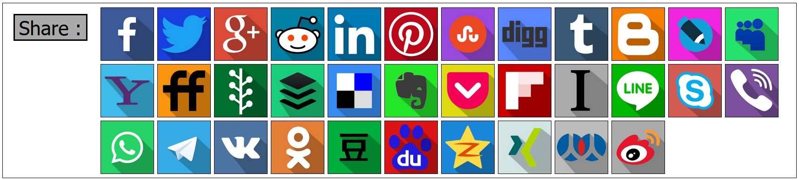

# Social Share Code Libraries

The Social Share Code Libraries project provides source code libraries for writing code that uses sharing on social-media.

All code is released under the permissive BSD-3-Clause License, so you should be able to use it in any of your projects, even if they are not permissively licensed like the BSD-3-Clause License.

## What does this Project provide?

* Social Media Source Code Libraries
    * `PHP`
    * `ReactJS`
    * `JavaScript`
    * `Perl`

## Who Maintains This Project?

This is a sub-project of Social Share URL's, a project for documenting the sharing URL API's of third-party, social-media websites.  Check out more about us here :

https://github.com/bradvin/social-share-urls

## Libraries?

* [PHP](#php)
* [ReactJS](#reactjs)
* [JavaScript](#javascript)
* [Perl](#perl)

### PHP

`Online Demo` :

* [EarthFluent.com : Learn French Online](https://www.earthfluent.com/french/view.php?action=index#comments)
* [Mikhail Bakunin : God and the State](http://www.revoltlib.com/anarchism/god-and-the-state/view.php#share)
* [List Keywords : Finding and Listing Your Keywords For You](http://www.listkeywords.com/)

`Code Sandbox` :

* [IdeOne.com](https://ideone.com/LuI4Ik)

`Sample Use` :

	$socmed = new SocialMedia();
	
	$social_media_names = $socmed->GetSocialMediaSites_WithShareLinks_OrderedByPopularity();
	$social_media_urls = $socmed->GetSocialMediaSiteLinks_WithShareLinks([
		url=>'http://w...content-available-to-author-only...t.com/',
		title=>'EarthFluent',
	]);
	
	foreach($social_media_names as $social_media_name) {
		$social_media_url = $social_media_urls[$social_media_name];
 
		print($social_media_name . ' : ' . $social_media_url . "\n\n");
	}

`Library Files` :

* [/code/php/SocialMedia.php](https://github.com/bradvin/social-share-urls/blob/master/code/php/SocialMedia.php)

### ReactJS

`Online Demo` :

* `N/A`

`Code Sandbox` :

* [CodeSandbox.io](https://codesandbox.io/s/98znjopzr4)

`Sample Use` :

    <SocialShareMedia
        url="http://www.earthfluent.com/"
        title="EarthFluent"
    />

`Library Files` :

* [/code/reactjs/package.json](https://github.com/bradvin/social-share-urls/blob/master/code/reactjs/package.json)
* [/code/reactjs/public/index.html](https://github.com/bradvin/social-share-urls/blob/master/code/reactjs/public/index.html)
* [/code/reactjs/src/SocialShareMedia.js](https://github.com/bradvin/social-share-urls/blob/master/code/reactjs/src/SocialShareMedia.js)
* [/code/reactjs/src/index.js](https://github.com/bradvin/social-share-urls/blob/master/code/reactjs/src/index.js)
* [/code/reactjs/src/styles.css](https://github.com/bradvin/social-share-urls/blob/master/code/reactjs/src/styles.css)

### JavaScript

`Online Demo` :

* [EarthFluent.com : Social Share Media JavaScript Demo](http://www.earthfluent.com/social-share-media.html)

`Code Sandbox` :

`Sample Use` :

	const socialmedia = GetSocialMediaSites_WithShareLinks_OrderedByPopularity();
	const socialmediaurls = GetSocialMediaSiteLinks_WithShareLinks({
		'url':$('#input_url').val(),
		'title':$('#input_title').val(),
	});
	
	var children = [];
	
	for(var i = 0; i < socialmedia.length; i++) {
		const socialmedium = socialmedia[i];
		
		children.push(
			'<tr><td class="output-label">' +
			socialmedium +
			'</td><td>' +
			socialmediaurls[socialmedium] +
			'</td></tr>'
		);
	}
	
	$('#output-table').empty();
	$('#output-table').append(children.join());

`Library Files` :

* [/code/javascript/social-share-media.html](https://github.com/bradvin/social-share-urls/blob/master/code/javascript/social-share-media.html)
* [/code/javascript/css/social-share-media.css](https://github.com/bradvin/social-share-urls/blob/master/code/javascript/css/social-share-media.css)
* [/code/javascript/javascript/social-share-media.js](https://github.com/bradvin/social-share-urls/blob/master/code/javascript/javascript/social-share-media.js)

### Perl

`Online Demo` :

* `N/A`

`Code Sandbox` :

* [ideone.com](https://ideone.com/rnq9Wg)

`Sample Use` :

	my @social_media_names = @{GetSocialMediaSites_WithShareLinks_OrderedByPopularity() || []};
	my $social_media_urls = GetSocialMediaSiteLinks_WithShareLinks({
			url=>'https://w...content-available-to-author-only...t.com/',
			title=>'EarthFluent',
	});
	 
	foreach my $social_media_name(@social_media_names) {
		my $social_media_url = $social_media_urls->{$social_media_name};
	 
		print($social_media_name . ' : ' . $social_media_url . "\n\n");
	}

`Library Files` :

* [/code/perl/social-share-media.pl](https://github.com/bradvin/social-share-urls/blob/master/code/perl/social-share-media.pl)
