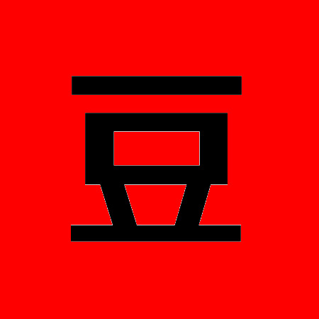
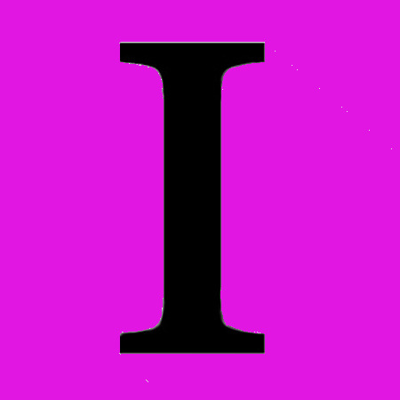
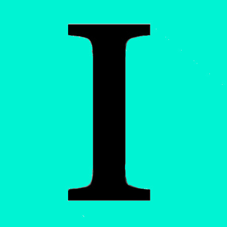
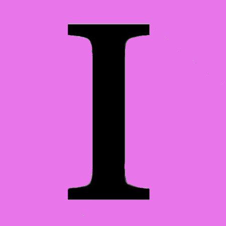
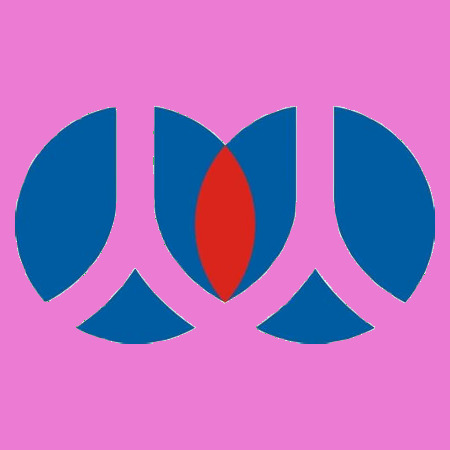
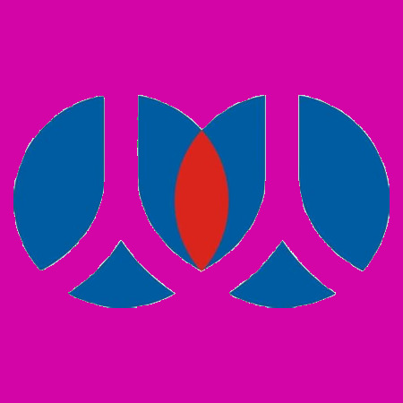
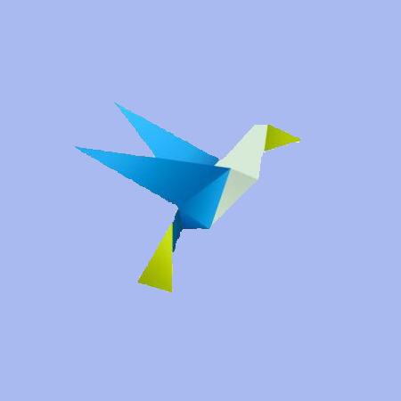
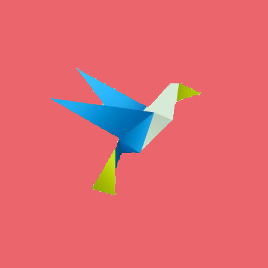
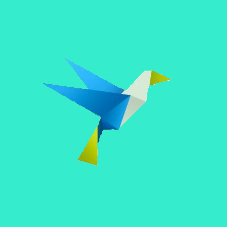
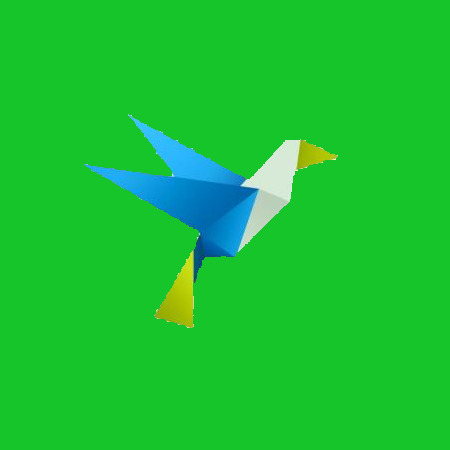

# Social Share Icons

The Social Share Icons project is trying to provide freely-distributed and permissively-licensed icons for social media websites.

All of these logos are owned by their respective, corporate holders, but everything we may have added that is copyrightable, such as cropping, stylizing, margin-setting, background-colors, shadows, or other graphical effects, are released into the `'''public domain'''`.

## What does this Project provide?

Social media icons.

* Size :
    * 450x450 pixels.
* Variations :
    * Opaque/Transparent Background (1x set)
    * All White Background (1x set)
    * Shadowed, Colorized Background (1x set)
    * Colorized Background (10x sets)

## Who Maintains This Project?

This is a sub-project of Social Share URL's, a project for documenting the sharing URL API's of third-party, social-media websites.  Check out more about us here :

https://github.com/bradvin/social-share-urls

## Icons?

*  [AddThis](#addthis)
*  [Baidu](#baidu)
*  [Blogger](#blogger)
*  [Buffer](#buffer)
*  [Diaspora](#diaspora)
*  [Digg](#digg)
*  [Douban](#douban)
*  [Email](#email)
*  [EverNote](#evernote)
*  [Facebook](#facebook)
*  [Flattr](#flattr)
*  [FlipBoard](#flipboard)
*  [GetPocket](#getpocket)
*  [Gmail](#gmail)
*  [GoogleBookmarks](#googlebookmarks)
*  [HackerNews](#hackernews)
*  [InstaPaper](#instapaper)
*  [Line.me](#lineme)
*  [Linkedin](#linkedin)
*  [LiveJournal](#livejournal)
*  [Okru](#okru)
*  [Pinterest](#pinterest)
*  [QZone](#qzone)
*  [Reddit](#reddit)
*  [Renren](#renren)
*  [Skype](#skype)
*  [SMS](#sms)
*  [Surfingbird.ru](#surfingbirdru)
*  [Telegram.me](#telegramme)
*  [Threema](#threema)
*  [Tumblr](#tumblr)
*  [Twitter](#twitter)
*  [Viber](#viber)
*  [VK](#vk)
*  [Weibo](#weibo)
*  [Whatsapp](#whatsapp)
*  [Wordpress](#wordpress)
*  [Xing](#xing)
*  [Yahoo](#yahoo)

### AddThis

<code>Site :</code> [https://www.addthis.com/](https://www.addthis.com/)

            

### Baidu

<code>Site :</code> [https://www.baidu.com/](https://www.baidu.com/)

            

### Blogger

<code>Site :</code> [https://www.blogger.com/](https://www.blogger.com/)

            

### Buffer

<code>Site :</code> [https://www.buffer.com/](https://www.buffer.com/)

            

### Diaspora

<code>Site :</code> [https://diasporafoundation.org/](https://diasporafoundation.org/)

            

### Digg

<code>Site :</code> [https://digg.com/](https://digg.com/)

            

### Douban

<code>Site :</code> [https://www.douban.com/](https://www.douban.com/)

            

### Email

<code>Site :</code> N/A.

            

### EverNote

<code>Site :</code> [https://evernote.com/](https://evernote.com/)

            

### Facebook

<code>Site :</code> [https://www.facebook.com/](https://www.facebook.com/)

            

### Flattr

<code>Site :</code> [https://flattr.com/](https://flattr.com/)

            

### FlipBoard

<code>Site :</code> [https://flipboard.com/](https://flipboard.com/)

            

### GetPocket

<code>Site :</code> [https://getpocket.com/](https://getpocket.com/)

            

### Gmail

<code>Site :</code> [https://www.gmail.com/](https://www.gmail.com/)

            

### GoogleBookmarks

<code>Site :</code> [https://www.google.com/bookmarks](https://www.google.com/bookmarks)

            

### HackerNews

<code>Site :</code> [https://news.ycombinator.com/](https://news.ycombinator.com/)

            

### InstaPaper

<code>Site :</code> [https://www.instapaper.com/](https://www.instapaper.com/)

            

### Line.me

<code>Site :</code> [https://line.me/](https://line.me/)

            

### Linkedin

<code>Site :</code> [https://www.linkedin.com/](https://www.linkedin.com/)

            

### LiveJournal

<code>Site :</code> [https://www.livejournal.com/](https://www.livejournal.com/)

            

### Okru

<code>Site :</code> [https://ok.ru/](https://ok.ru/)

            

### Pinterest

<code>Site :</code> [https://www.pinterest.com/](https://www.pinterest.com/)

            

### QZone

<code>Site :</code> [https://qzone.qq.com/](https://qzone.qq.com/)

            

### Reddit

<code>Site :</code> [https://www.reddit.com/](https://www.reddit.com/)

            

### Renren

<code>Site :</code> [http://sns.renren.com/](http://sns.renren.com/)

            

### Skype

<code>Site :</code> [https://www.skype.com/](https://www.skype.com/)

            

### SMS

<code>Site :</code> N/A

            

### Surfingbird.ru

<code>Site :</code> [https://surfingbird.ru/](https://surfingbird.ru/)

            

### Telegram.me

<code>Site :</code> [https://telegram.me/](https://telegram.me/)

            

### Threema

<code>Site :</code> [https://threema.ch/](https://threema.ch/)

            

### Tumblr

<code>Site :</code> [https://www.tumblr.com/](https://www.tumblr.com/)

            

### Twitter

<code>Site :</code> [https://twitter.com/](https://twitter.com/)

            

### Viber

<code>Site :</code> [https://www.viber.com/](https://www.viber.com/)

            

### VK

<code>Site :</code> [https://vk.com/](https://vk.com/)

            

### Weibo

<code>Site :</code> [https://www.weibo.com/](https://www.weibo.com/)

            

### Whatsapp

<code>Site :</code> [https://www.whatsapp.com/](https://www.whatsapp.com/)

            

### Wordpress

<code>Site :</code> WordPress is software that lets you run a social website, which the creators would then probably make their own icons for.  But if you want to know more, [https://wordpress.org/](https://wordpress.org/)

            

### Xing

<code>Site :</code> [https://www.xing.com/](https://www.xing.com/)

            

### Yahoo

<code>Site :</code> [https://www.yahoo.com/](https://www.yahoo.com/)

            
